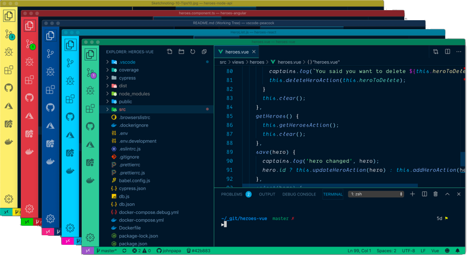

**Title:** VS Code Hacks & Setting Up for Success  
**Type:** Morning Exercise 
**Duration:** 0:45 
**Creator:** Kristyn Bryan 
**Adapted by:** Cathleen Wright, Karolin Rafalski, Grant Knief, Kenny Cruz, Esin Saribudak 
**Competencies:** VS Code extensions and shortcuts, Spectacle, Command Line & Keyboard shortcuts  
**Prerequisites:** VS Code, CLI 

## Objectives

-   Students will download and use VS Code extensions that enrich and improve the coding experience
-   Students will be able to utilize shortcuts on the keyboard, Spectacle, terminal, and VS Code
-   Students will start building good habits and gain an understanding of how to be a more efficient coder

## Agenda

-   Preface: The importance of starting good habits today
-   Part 1: VS Code Extensions, Settings and Shortcuts
-   Part 2: Screen Real Estate and Window Management with Spectacle
-   Part 3: Mac Shortcuts
-   Part 4: Terminal Shortcuts
-   Part 5: Typing
-   Further Reading & Resources

## A Quick Note

We try to keep all of our repositories updated with all the links working and images showing up, but sometimes things get moved around (especially when we just checked them a couple days ago!). If any links or images are broken, please let us know and we'll update them!

## Introduction

As an aspiring web developer, you have a lot to learn. One really critical thing to focus on is starting good habits as early as possible. If you teach yourself the most efficient ways to do things now, you won't have to go back and correct yourself later. You'll also learn to code faster and have a better workflow, where you won't lose minutes switching between applications and windows, and resizing windows to maximize efficiency. Utilizing keyboard shortcuts will also help you type faster and let you focus on the task at hand.

A lot of these steps will feel awkward at first, but the more you use them, the sooner they'll become second nature and be engraved into your muscle memory. Part of succeeding is just taking a deep breath and taking a moment to practice the better way, then it'll get easier and easier.

There are hundreds, if not thousands, of little things you can do to make you a more effective coder. Here we're going to focus on a small group of things that will have the biggest impact on maximizing your efficiency as a developer.

:closed_lock_with_key: We will be downloading applications to your computer. Make sure you have the password for your Mac in order to proceed.

**Suggestion: Bookmark or download this repository for future reference** 🤓

## Part 1 - VS Code Extensions & Shortcuts

### Launching VS Code from Terminal (most of you have already done this)

-   Open VS Code by clicking on the icon in your dock, OR by opening your search `cmd` + `space` and typing `vscode`).
-   Most of you already did this, but if you can't launch VS Code from your terminal yet: open the Command Palette (⇧⌘P) and type 'shell command' to find the Shell Command: Install 'code' command in PATH command.

-   You might need to quit terminal _and_ VS Code (`cmd` + `q`) in order for this to take effect.
    -   Make sure you are `quitting` terminal and VS Code, not just closing the program to install shell commands.
    -   Whenever you quit terminal, a REALLY good habit is to always type `exit` as the command to shut down all terminal processes, then close the terminal window with (`cmd` + `q`)

### Then how do I know it worked?

1.  Open terminal again (if you had to close it).
1.  Navigate back into the `deleteme` directory.
1.  Type `code .` to open the whole directory, or `code test.html` to open just the file (try using the tab autocomplete!) and hit **enter**.
1.  Wait a moment, and VS Code will open the directory or file you requested!

## Extensions (Mini Installfest)

If you have not yet installed the extensions specified by Jennifer during Installfest, let's do so now:

### Installed During Installfest (skip this part if you added these already):

-   [x] **Live Server** (you guys did this yesterday!): allows you to continually refresh your index.html file in your browser after making changes in your code editor 🌊
-   [x] **ES Lint**: "lints" or analyzes your code for potential errors ✅
-   [x] **Prettier Code Formatter**: an opinionated code formatter that can automatically adjust indentation and semicolons for you 🌸
-   [x] **Auto Rename Tag**: automatically renames tags
-   [x] **Auto Close Tag**: automatically closes tags
-   [x] **VS Code Icons**: custom file icons
-   [x] **Git Link**: allows you to quickly find GitHub links to your files
-   [x] **Git Lens**: shows status and owner of changes to Git-tracked files
-   [x] **Bracket Pair Colorizer**: uses different colors for your brackets and parentheses so you can keep track of them
-   [x] **Path Intellisense**: auto-completes file names AKA paths.

### Esin's Additional Recommendations (totally optional):

-   [ ] **Live Share**: Allows you to simultaneously work in VS code files with other developers in real-time (like Google docs), which will be very useful for pair-programming in future assignments
-   [ ] **Code Spell Checker**: Automatically spell-checks your code (so that you don't ever have to spend hours debugging only to realize you misspelled your variable on line 56 🤦‍♀️)
-   [ ] **Peacock**: Allows you to select different background colors for multiple code editors (useful if you're working on two different projects, like a frontend and a backend, to quickly tell the two apart):
        
-   [ ] **Markdown Preview Enhanced**: Allows you to preview your README.md files in VS Code (this will come in handy when you write out a detailed README for your projects so that potential employers and other developers understand what you did, and here is a great resource for [styling markdown files](https://guides.github.com/features/mastering-markdown/)):
        

## VS Code Settings

### Auto-Format on Save

-   Semicolons
-   Indentation
-   Auto-format on save

### Wrapping Text

You have a limited amount of visible space in your files, so wrapping your text will help you to see all the code in a line without needing to scroll horizontally.

1. Click on `Code` and hover over `Preferences`, then click on `Settings` 

2) Scroll Down to `Editor: Word Wrap`. Select `on` from the dropdown.  
   

3. Your long lines of code will now be wrapped at the width of your viewport.  

## VS Code Shortcuts & Tricks

### Selecting Code

-   To select the same word or values in multiple places in your document, use `command` + `d`
-   To move a line of code up or down, move your cursor to the line, press `option` and use the `up` or `down` arrows.

### HTML Boilerplate

-   Every HTML document needs the same basic tags. There's an easy way to do this in VS Code.
-   Type `html:5` and hit `tab`. The boilerplate should autocomplete (this saves us a lot of time).
-   File types matter. Notice how we're in a `.html` file!

### Commenting Code

Whether you're in an HTML, CSS, or JavaScript file, if you want to comment out your code (have the program ignore some lines of code), you can highlight your code and use one command: `command` + `/`.

:eyes: Commented out code looks different depending on the file type, so you'll use this shortcut frequently!

#### :hourglass: Activity (2 minutes)

-   Write some notes to yourself inside your HTML boilerplate `<body>` tag, and then comment them out using the shortcut!

### Split Screen

-   If you have more than one file that you'd like to look at in VS Code, you can go up to `View` --> `Editor Layout`and then choose how you would like your panes to be displayed.  

Or you can click and drag the tab to where you'd like your new pane to be!

-   You can also click and drag the tab, a 'shadow' window will appear of where the tab will go and split, if it is right, just let go, if you want it somewhere else, keep dragging it around.

### Indentation

Code is indented to show parent/child relationships and emphasize hierarchy. It also makes it a lot easier for humans to read. Just like how authors indent new paragraphs, you should indent code frequently. Take the extra time (that you saved with all your shortcuts!) to indent your code properly _as you write it_.

:book: When you have time, check out the [AirBnB style guide](https://github.com/airbnb/javascript) for commonly-used industry practices.

### Tabs Over Spaces

When indenting your code, please use the tab button. [Do not use your spacebar](https://youtu.be/SsoOG6ZeyUI).

## Part 2 - Spectacle

-   Spectacle helps you to move and resize your screens with the a few clicks on your keypad. You no longer have to waste time using your mouse to rearrange the size of the screen.
-   Not only will this help to save you time, but it will help to add to the illusion that you are a bada\$\$ h4ck3r

[Keanu whoa](https://media.giphy.com/media/3rVfBUa9f0RErtMZBH/giphy.gif)

### :computer: Click on this link https://www.spectacleapp.com/ and download and install Spectacle.

Once it's installed, you should have little glasses  at the top, right of your screen.

### Allow Spectacle

-   Spectacle needs to change your computer's privacy settings to allow this application. To do this, in your Spotlight (open with `cmd` + `space`), type **Security & Privacy** or open **Security & Privacy** from the **System Preferences** icon in the dock. Once open, you should see this:

-   Click on the lock in the bottom left. You will be prompted to enter your computer password:

-   Click on Spectacle to give it permission:

-   Click on the lock again to save the changes:

### Update Spectacle Preferences

-   Now, click on the glasses at the top of your screen and select `Preferences`.

-   Enable Spectacle to load at login, or you will need to start the program every time you restart.

-   You will likely use full screen, right half, left half and bottom half the most frequently.

#### :hourglass: Activity (3 minutes)

-   Try to organize your windows using Spectacle (and then adjusting as needed) like so:

Monitors

## Part 3 - Mac Keyboard Shortcuts

### Shortcuts for any occasion!

-   Here are the shortcuts that you will use most often:

|     Shortcut     |                                                  Description                                                  |
| :--------------: | :-----------------------------------------------------------------------------------------------------------: |
|    Command-A     |                                             Select **All** Items                                              |
|    Command-C     |               **Copy** the selected item to the Clipboard. This also works for files in Finder                |
|    Command-S     |                                                 **Save** file                                                 |
|    Command-V     | **Paste** the contents of the Clipboard into the current document or app. This also works for files in Finder |
|    Command-X     |                        **Cut** (remove) the selected item and copy it to the Clipboard                        |
|    Command-Y     |                       **Redo** - redo something you undid (when you've used Command-Z)                        |
|    Command-Z     |                                     **Undo** the previous command/typing                                      |
| Command-Shift-4  |                                               Take a screenshot                                               |
| Command-Spacebar |                                                Open Spotlight                                                 |
| Option-Command-J |                                    In Chrome, opens **Dev Tools/Console**                                     |

#### :hourglass: Optional Self-Guided Activity (5 minutes)

-   Open your Desktop or Documents in VS Code
-   Make a file
-   Copy ALL (command A) the text from this file (you can copy from the browser)
-   Paste (command V) the text into your new file
-   Save (command S) - there is a blue dot on the top tab of your file that should disappear once your file has successfully saved
-   Undo (command Z) - your text should go away
-   Redo (command Y) - your text should come back
-   Cut (Command X) - the title of your copy of this document
-   Paste (Command V) - to the bottom of your copy the document
-   Save (Command S) - one final time
-   take a screenshot of something

:computer: [Additional Mac Keyboard Shortcuts](https://support.apple.com/en-us/HT201236)

## Part 4 - Command Line in Terminal

-   You will find yourself having to re-run applications when testing your app or you will find yourself needing to retype certain lines over and over again. Be lazy! It will give you more energy for the important stuff.

#### Command Line Shortcuts

##### The two most handy ones for you right now are the up arrow and tab:

If you would learn any two - learn these!

:arrow_up: Are you running the same command over and over again? Use the **up arrow** to show your previous commands. Hit **enter** to run them.

:star: Use **tab** to autocomplete a file or folder name by beginning to type it out. If it's not autocompleting, you may be in the wrong directory - be mindful of case sensitivity as well!

| Shortcut  |                      Description                       |
| :-------: | :----------------------------------------------------: |
| Control-A |             Go to the start of the prompt              |
| Control-E |              Go to the end of the prompt               |
| Control-U |                 Clear the current line                 |
| Control-C | Stop the running process (works for many, but not all) |
| Command-K |                    Clear the window                    |

:computer: Additional Command Line Shortcuts for Terminal can be found on our [class wiki](../../../../../wiki/Terminal-Cheatsheet).

#### :hourglass: Optional Activity (5 minutes)

-   Open your terminal and let's try out a few terminal shortcut commands while completing the steps below.
-   You can open terminal via the dock, or by using Spotlight Search (`cmd` + `space`) and typing `terminal`.

1. Create a folder on your desktop called `deleteme`.
    - `cd Desktop` **Tab it** only type `cd De` and then press tab
    - :eyes: `Desktop` is spelled by your computer with a capital `D`! The terminal is case sensitive.
    - `mkdir deleteme`
2. Inside `deleteme`, create a file `test.html`.
    - `cd deleteme` **Tab it** only type `cd de` and then press tab
    - `touch test.html`
    - You can name your file whatever you want, but it must end with `.html`!
    - press the up arrow `touch test.html` should reappear
    - `control-u` clear the line of text
    - `command k` clear the window
    - `ls` - make sure you're still in the right directory

## Part 5: Typing & Miscellaneous

### Getting Better Faster

-   Coding often means reaching for keys that you're not used to. Take 2-5 minutes every day to practice if you're rusty!
-   Try `typing.io` that specifically lets you practice typing code (letters and other characters!).
-   You can also google `learn to type free` to find the right typing practice for you, even going back and practicing touch typing regular characters can help you speed up.

### Workflow Suggestions

-   Download the repo for every lecture/lab/exercise, and place it in the appropriate directory within your `/sei` folder to stay organized.
-   Only fork and clone homework assignments that you will need to turn in via pull request.
-   I strongly recommend using [Dark Mode](https://support.apple.com/en-us/HT208976) on your Mac, in [Visual Studio Code](https://code.visualstudio.com/docs/getstarted/themes), and wherever else possible to reduce eye strain and blue light exposure.

## Summary

-   We covered a lot of different short cuts and tools today. Come back to this markdown as a reference and look up the things we did and keep practicing!
-   These shortcuts will help you spend less time and energy managing your screen and workflow, and more time and energy thinking about writing GOOD CODE.
-   As you learn more about what it means to be a developer, find the tools and extensions that work for YOU and make you HAPPY when you code. 👩‍💻👨‍💻
-   This course is intense, but it should never get in the way of self-care. A gentle reminder to make sure you are eating well, getting out of the house, stretching, sleeping enough, and finding ways to unwind that aren't in front of a screen.
-   There is an expression: "If you don't have time to do it right the first time, when will you have time to do it right a second time?" So take those extra moments to do it right - your future self will thank you. 🙏

## Additional Resources

-   [Bullet Journaling](https://bulletjournal.com/pages/learn): a really cool productivity habit that I highly recommend
-   [Coding Journals](https://www.makeuseof.com/tag/become-better-coder-keeping-programming-journal/): an awesome way to keep track of your growth as a coder and synthesize the different concepts you learn
-   [Trello Boards](https://trello.com): a great free service for people who love interactive, visual to-do lists, and widely-used in development for project planning
